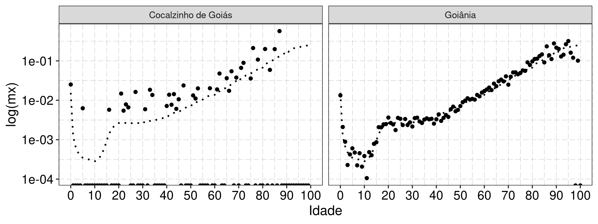
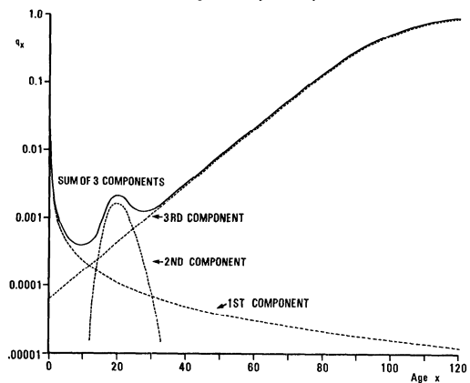
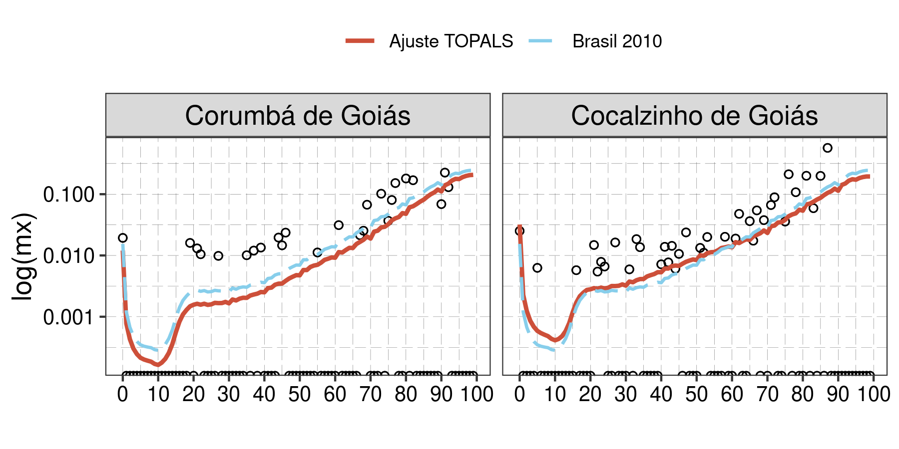
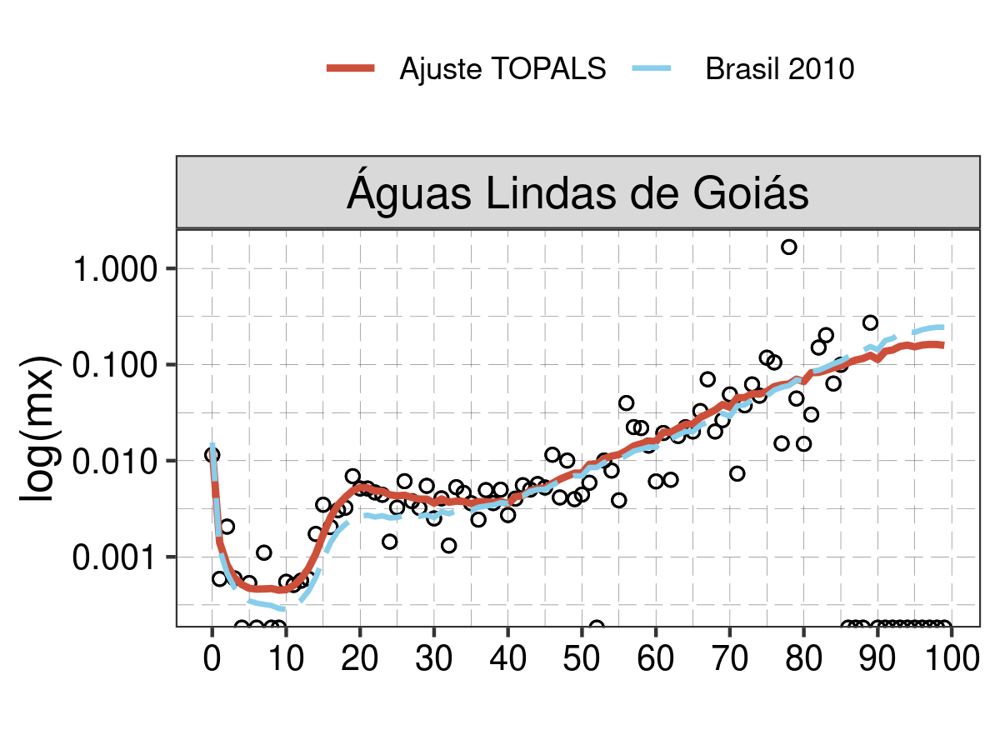
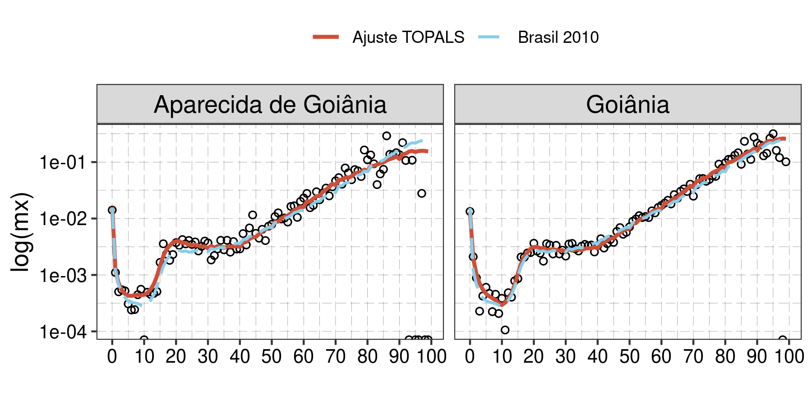

```{r setup, include=FALSE}
knitr::opts_chunk$set(echo = TRUE, fig.align = "center", out.height = "7cm")
options(width=60)
```

## Motivação

\renewcommand{\figurename}{Figura}
\renewcommand{\tablename}{Tabela}



## Métodos de Suavização de Mortalidade 

\renewcommand{\figurename}{Figura}
\renewcommand{\tablename}{Tabela}

\small
Modelos Paraméticos

* Modelo de Heligman-Pollard [@heligman_pollard1980]:  desenvolvido a partir das leis da mortalidade, com 3 termos e 8 parâmetros

$$\frac{q_x}{p_x} = A^{(x+B)^C} + D \exp[-E (\log{x} - log{F})^2] + GH^x$$


{ height=42% }


## Métodos de Suavização de Mortalidade 

Modelos Relacionais 

* Modelo Relacional de Brass [@stewart2004]: ajusta curva de mortalidade observada a partir da relação linear entre os logitos da curva observada e de uma curva escolhida como padrão (*standard*)

$$Y(x) = \log \Big({\frac{q(x)}{1-q(x)}} \Big)$$

$$Y(x) = \alpha + \beta Y_s(x)$$

## Métodos de Suavização de Mortalidade 

Métodos não-paramétricos

* Splines e polinômios

* Ajustes melhores e mais flexíveis que os modelos paramétricos

* Desvantagem: falta de parâmetros interpretáveis do ponto de vista teórico [@beer2011]

## TOPALS Apresentação

\small
**TO**ols for

**P**rojecting 

**A**ge-Specific rates using 

**L**inear 

**S**plines

* Modelo relacional para suavização de taxas específicas (por idade) de mortalidade e fecundidade

* TOPALS utiliza de um spline linear pra modelar as razões entre taxas/probabilidades específicas por idade 

## Aplicações em Estudos de Mortalidade

\small
* Projeções: @wilson2018 e @beer2012

* Suavização de taxas: @gonzaga_schmertmann2016 usam o TOPALS para suavização de taxas em pequenas áreas do Brasil, aplicação que destacaremos a seguir

## Suavização de Taxas utilizando o Método TOPALS 

$$q_x^{observado} = r_x q_x^{padrão}$$

* $q_x$: probabilidade de morte à idade x ($q_x \propto m_x$)

* $r_x$: razão de risco à idade x modelada como uma função spline linear

$$r_x = a + \sum_{j=1}^{n} b_j (x - k_j)D_{xj}$$

* $D_{xj} = 0$ caso $x \leq k_j$ e $D_{xj} = 1$, caso contrário

* $k_j$ são os nós que conectam os segmentos

* $a$ e $b_j$ são parâmetros a serem estimados

## Estimativa de parâmetros

Aplicamos aqui a variante de @gonzaga_schmertmann2016 e @schmertmann2018 para estimativa dos parâmetros a partir de uma Regressão Poisson baseada no método TOPALS. Sejam,

* $\lambda(\alpha)$ um vetor com os logarítmos das taxas específicas de mortalidade (usando idades 0 a 99, vetor 100 x 1 );

* $B$ matriz de constantes em que cada coluna é uma função linear B-spline (com nós fixados nas idades 0, 1, 10, 20, 40, 60 e 80); e 

* $\alpha$ um vetor de parâmetros que representam o *offset* para a curva padrão escolhida de mortalidade; assim:

$$\lambda(\alpha) = \lambda^{padrão} + B * \alpha$$

## Estimativa de parâmetros

Assume-se que a contagem de óbitos observada ($D_x$) segue uma distribuição Poisson (independente por idade), tal que $D_x \sim \text{Pois}(N_x \exp(\lambda_x))$, onde $N_x$ é a população exposta ao risco de morte na idade x [@gonzaga_schmertmann2016], assim, o logarítmo da função de verossimilhança é tal que:

$$ \log L(\alpha) = K + \sum_x \Big[ D_x \lambda_x(\alpha) - N_x \exp(\lambda_x(\alpha)) \Big]$$
Adiciona-se um termo de penalização à função de verossimilhança para evitar ajustes não plausíveis nas áreas em que a contagem de óbitos forem pequenas:

$$ Q(\alpha) = \sum_x \Big[ D_x \lambda_x(\alpha) - N_x \exp(\lambda_x(\alpha)) \Big] - \sum_{k=0}^5(\alpha_{k+1}-\alpha_{k})^2$$

* O termo de penalização tem pouco efeito em áreas com $N_x$ e $D_x$ grandes e ajuda a estabilizar as estimativas em áreas com populações pequenas


## Aplicação: Estado de Goiás

Suavização de taxas de mortalidade em pequenas áreas do Estado de Goiás utilizando a curva de mortalidade do Brasil como padrão.

Cidades selecionadas: 

* Goiânia (1 302 001 habitantes)

* Aparecida de Goiânia (455 657 habitantes)

* Águas Lindas de Goiás (159 378 habitantes)

* Cocalzinho de Goiás (17 407 habitantes)

* Corumbá de Goiás (10 361 habitantes)


## Fontes de dados

População Exposta ($N_x$): Censo Demográfico 2010 (IBGE)

Óbitos ($D_x$): DATASUS (Ministério da Saúde)

* Para os municípios, selecionou-se somente os óbitos ocorridos em 2010;

* Para a curva padrão do Brasil, a contagem de óbitos para o meio do período de referência (meio do ano de 2010) foi estimada a partir da média anual de óbitos ocorridos entre 2009-2011

## Resultados: Municípios de pequeno porte

\renewcommand{\figurename}{Figura}
\renewcommand{\tablename}{Tabela}

{ height=72% }

## Resultados: Municípios de porte intermediário

\renewcommand{\figurename}{Figura}
\renewcommand{\tablename}{Tabela}

{ height=72% }

## Resultados: Municípios de maior porte

\renewcommand{\figurename}{Figura}
\renewcommand{\tablename}{Tabela}

{ height=72% }

## Considerações Finais

* TOPALS: método de ajuste e suavização de curvas de mortalidade útil para áreas com populações pequenas ou poucas contagens/alto sub-registro de eventos

* Para áreas maiores, o papel da curva padrão é minimizado

* Ferramenta importante para estudos demográficos mais desagregados ou em países com fontes de informações de baixa qualidade

## Códigos e Replicação

Da apresentação e dos exemplos utilizados:

* https://github.com/josehcms/MI602_2s2020

Do variante do método TOPALS proposta por @gonzaga_schmertmann2016 e @schmertmann2018:

* https://github.com/schmert/TOPALS

## Bibliografia {.allowframebreaks} 